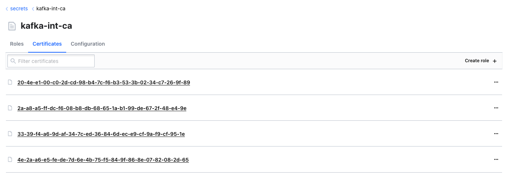
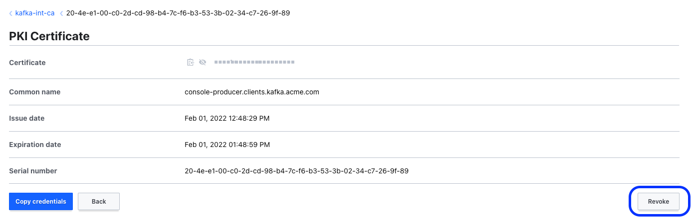

# Confluent Platform with Vault as PKI

Vault can be used as a PKI provider to manage SSL/TLS certificates.

This example is heavily influenced by this blog post: https://opencredo.com/blogs/securing-kafka-using-vault-pki/

## How to run

TL;DR:

```shell
make prep
```

This will:

- Clean PKI dir,
- Start Vault
- Create PKI and roles
- Create Certificates and KeyStores
- Start Kafka and create a topic

Once it's finished, generate a kafka-client Vault token to create certificates and keystore for (console) Producer and Consumer:

```shell
make client_token
vault token create -field=token -role kafka-client
s.wwHX4582ZwULW4nDBfVWD31m
```

and

```shell
make VAULT_TOKEN=s.wwHX4582ZwULW4nDBfVWD31m producer_keystore consumer_keystore
```

Finally, start producer and consumer:

```shell
make consumer_run
```

```shell
make producer_run
```

Finally, to clean up: `make destroy`

## Scenarios

### Revoke Certificates

Pre-conditions:

- Brokers need to be configured with CRL enabled to validate revocation list:

```yaml
      ## Here is where CRL validation for revoked certificates is enabled.
      KAFKA_OPTS: "-Dcom.sun.security.enableCRLDP=true -Dcom.sun.net.ssl.checkRevocation=true"
```
Source: [docker-compose](docker-compose.yml) Kafka environment definition.

- producer and consumer are writing and reading data properly.

Check certificates created on the intermediary CA:



Revoke certificate



Try to connect again and produce:

```shell
make producer_run
/usr/local/apache/kafka/kafka_2.13-3.1.0/bin/kafka-console-producer.sh --topic test --bootstrap-server localhost:9093 \
                --producer.config ./config/producer.properties
>[2022-02-01 12:59:13,550] ERROR [Producer clientId=console-producer] Connection to node -1 (localhost/127.0.0.1:9093) failed authentication due to: SSL handshake failed (org.apache.kafka.clients.NetworkClient)
```
